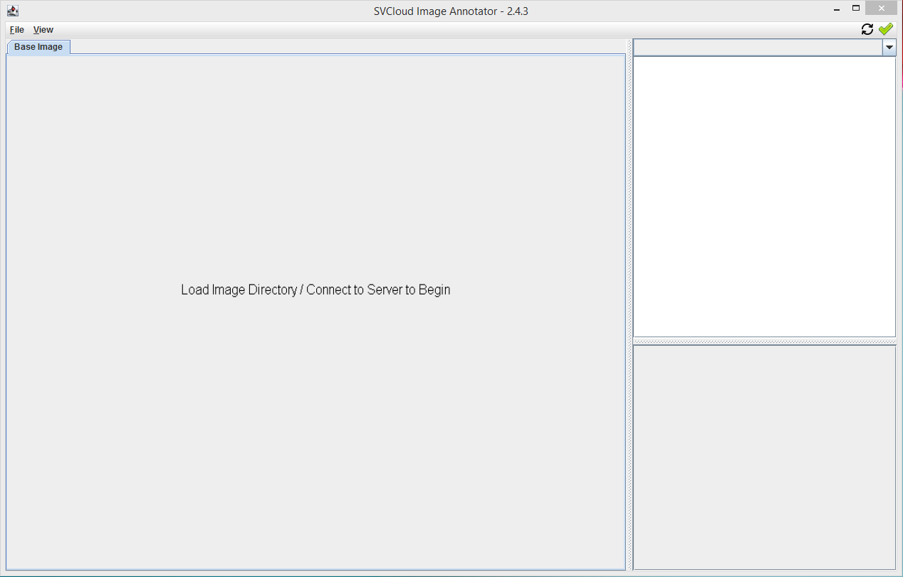
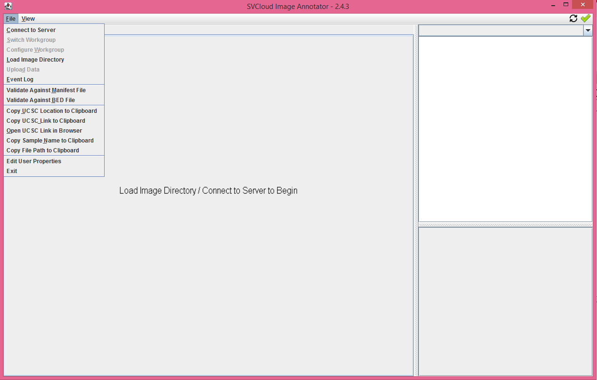
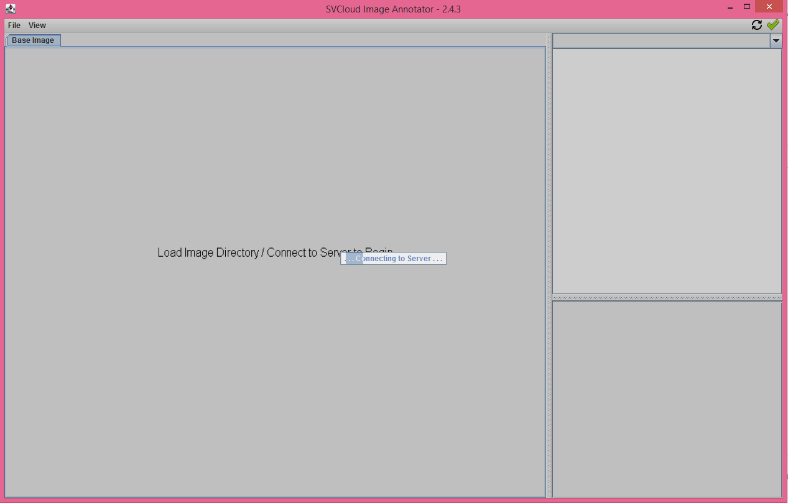
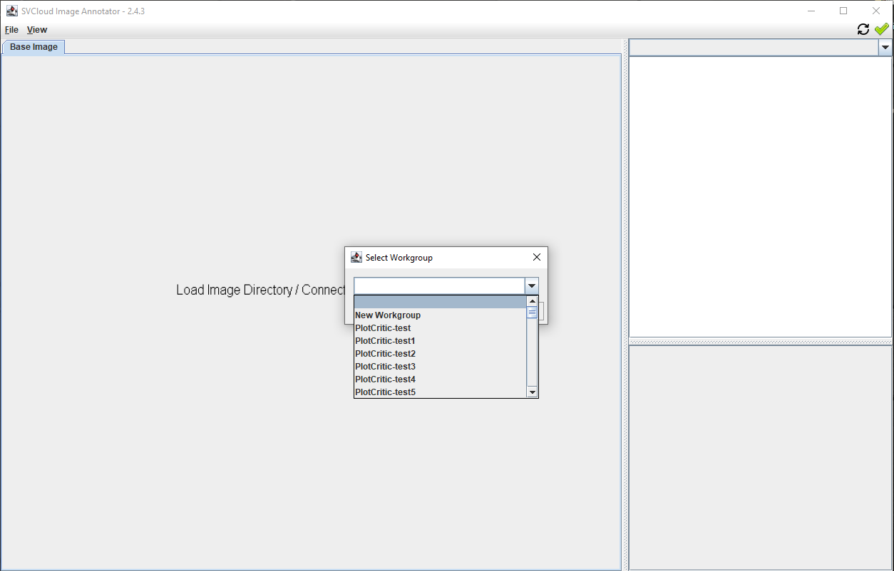
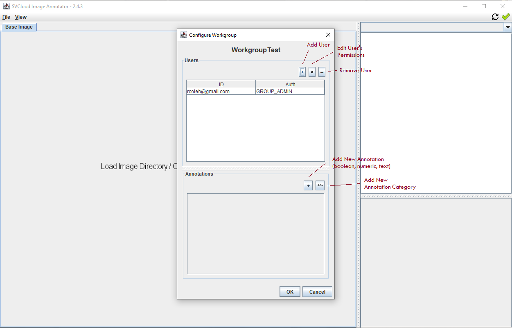
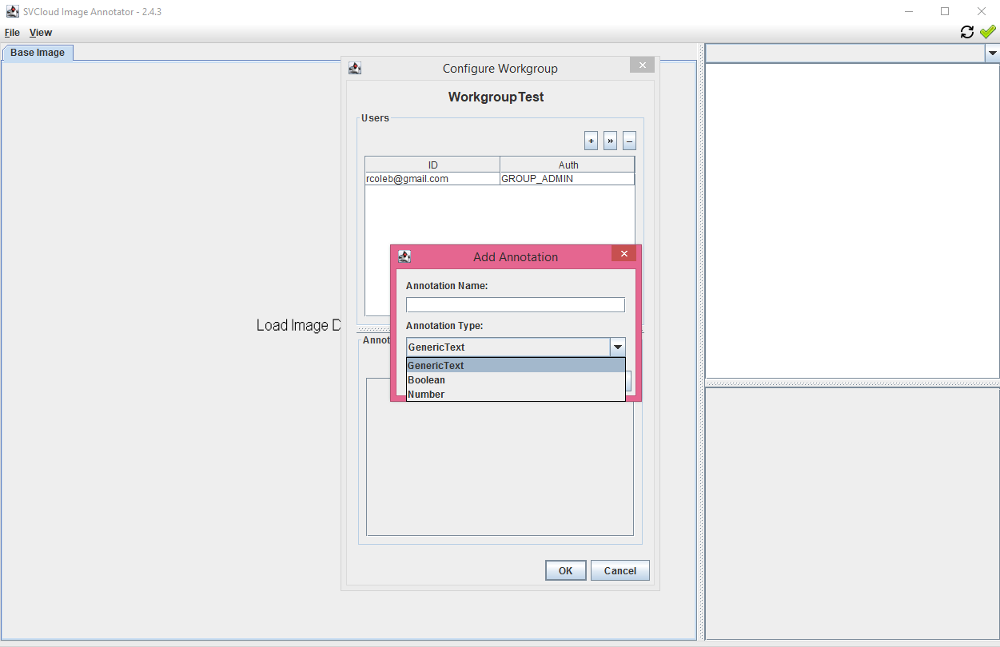
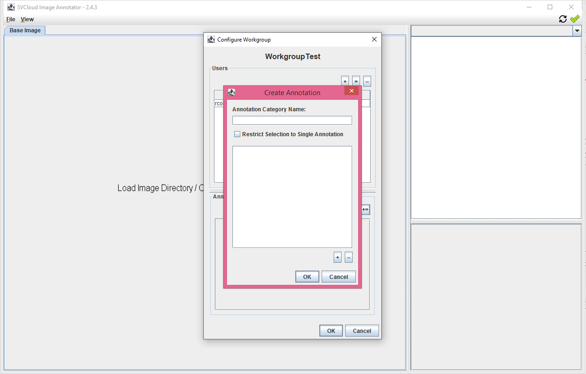
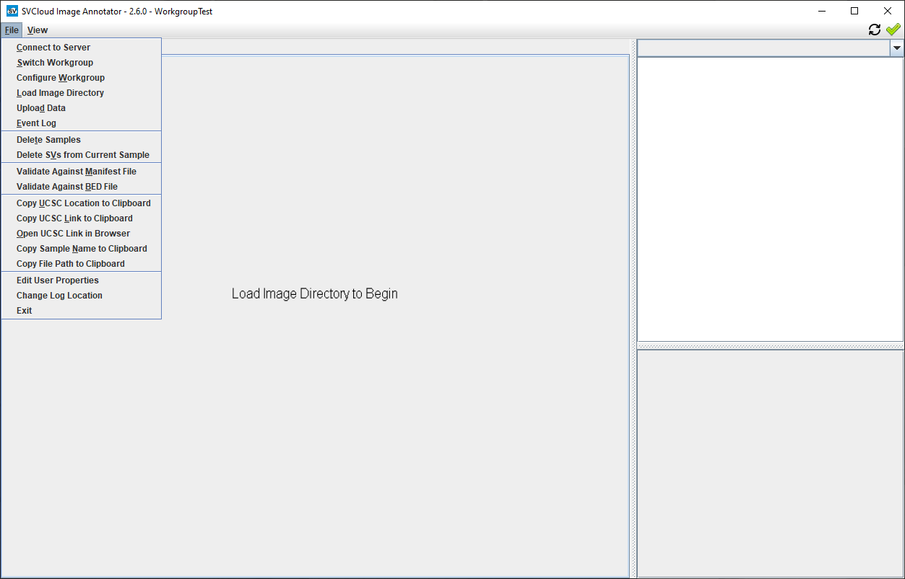

## Getting Started  

### Welcome to SVAnnotator!  

First, open the menu and select "Connect to Server":

A browser window will open and ask you to login to Google.  After login this window can be closed.

### Creating a Workgroup

After connecting, the workgroup selection popup will appear.
 

The dropdown menu lists all workgroups to which your username has access.   

To begin, create a new workgroup; or, choose a workgroup and press the 'Select' button.

To create a new workgroup, type a new workgroup name into the selection field and press 'Configure'

The workgroup configuration window will open, allowing you to add users and editable annotations to your new workgroup.  

You are automatically a group admin in your new workgroup (you can change this, but you might not be able to change it back!).  

Annotations come in four types: boolean, numeric, text, and category.  

The first three are straightforward: boolean annotations are yes/no, numeric annotations accept any number value, and text annotations accept any text input.  

Annotation categories are annotations with a restricted subset of options, similar to a menu or dropdown.  

You can add any number of values to an annotation category.  Users can either select any number of options, or you can choose to restrict the selection to a single value.

After selecting or creating your workgroup, SVAnnotator will return to the ready screen (first image, above).  However, the ready message has changed and new menu options are now available:

### Support or Contact

Having trouble with SVAnnotator?  Please contact us at help@genvisis.org for assistance.  If possible, please attach the most recent log file to your email.  

Logs are located:
 - on Windows computers at %LocalAppData%/sv-image-annotator/app/logs/
