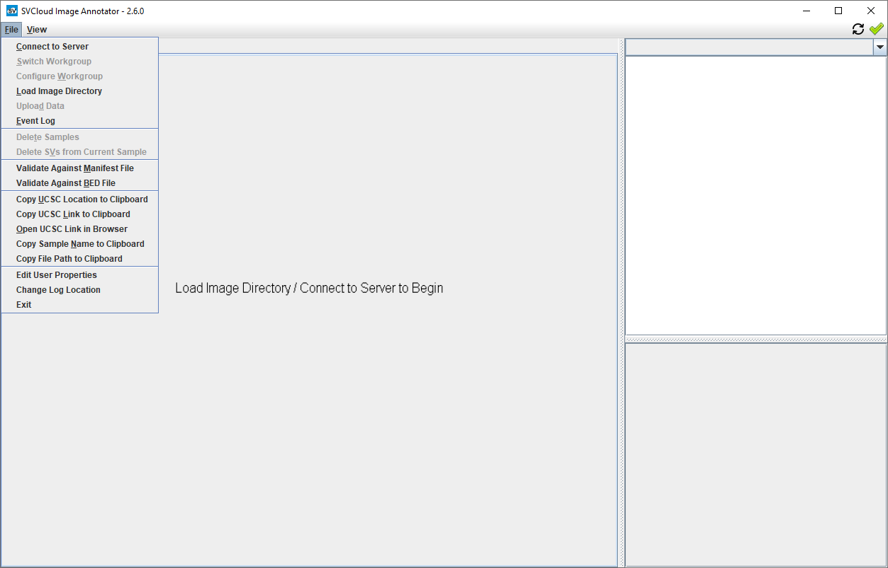
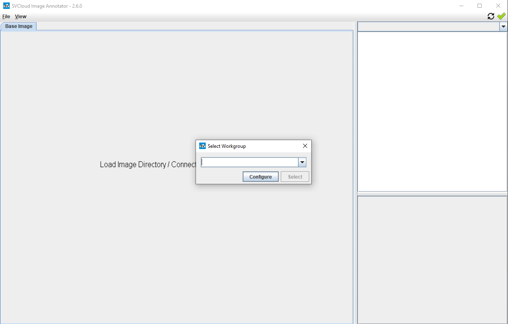
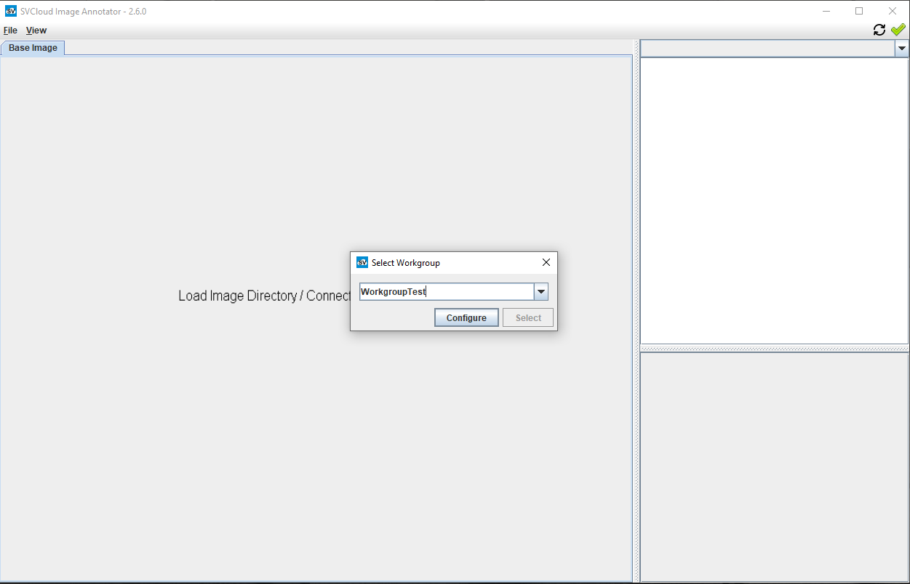

## Getting Started with SVCloud Image Annotator (SVCA)
{:.no_toc}

### Table of Contents
{:.no_toc}

* TOC
{:toc}

### Connecting to the Server 

First, open the menu and select "Connect to Server":

A browser window will open and ask you to login to Google.  After login this window can be closed.  

<a href="#">Back to top</a>

### Creating a Workgroup  

After connecting, the workgroup selection popup will appear.
 

The dropdown menu lists all workgroups to which your username has access.   

To begin, create a new workgroup; or, choose a workgroup and press the 'Select' button.

To create a new workgroup, type a new workgroup name into the selection field and press 'Configure'.

<a href="#">Back to top</a>

### Configuring a Workgroup

The workgroup configuration window will open, allowing you to add users and editable annotations to your new workgroup.  

You are automatically a group admin in your new workgroup (you can change this, but you might not be able to change it back!).  

<a href="#">Back to top</a>

### Creating Annotations

Annotations come in four types: boolean, numeric, text, and category.  

The first three are straightforward: boolean annotations are yes/no, numeric annotations accept any number value, and text annotations accept any text input.  

Annotation categories are annotations with a restricted subset of options, similar to a menu or dropdown.  

You can add any number of values to an annotation category.  Users can either select any number of options, or you can choose to restrict the selection to a single value.

<a href="#">Back to top</a>

### Loading Image Files

After selecting or creating your workgroup, SVCA will return to the ready screen.  However, the ready message has changed and new menu options are now available:

<a href="#">Back to top</a>

### Uploading Annotations from a Manifest File

<a href="#">Back to top</a>

### Show/Hide Samples and SVs

<a href="#">Back to top</a>

### Support / Contact

Having trouble with SVCA?  Please contact us at help@genvisis.org for assistance.  
If possible, please attach the most recent log file to your email.  

Logs are located:
 - on Windows computers at `%LocalAppData%/sv-image-annotator/app/logs/`  
    (this location can be changed in the `File` menu)

<a href="#">Back to top</a>

### Changelog

#### v2.6.3   (02/11/2021)
 - Allow loading images from TAR archives
 - Ignore missing values (e.g.: '.', '-', 'NA', etc) in manifest files
 - Add tooltip to upload GUI reset button
 - Report program version at startup and check against remote version
 - Show data upload error code in pop-up
 - Fix text field width for text annotations
 - Fix upload GUI progress monitoring when (up)loading large manifest files
 - Fix Show/Hide for SVs
 - Reduce excess redraws

#### v2.6.2  (02/07/2021)  
 - Fix bugs in validation using BED files 
 
#### v2.6.1  (02/01/2021)  
 - Fix visual spacing in right-click menu and add manifest file format mouseover info
 - Parse CN# in image file name (instead of DUP/DEL/etc)

#### v2.6.0   (06/05/2020)  
 - Add icon to all windows
 - Add sample/sv delete
 - Add hide by annotation menu
 - Update menu labels and structure
 - Update delete dialog message
 
 
<a href="#">Back to top</a>

