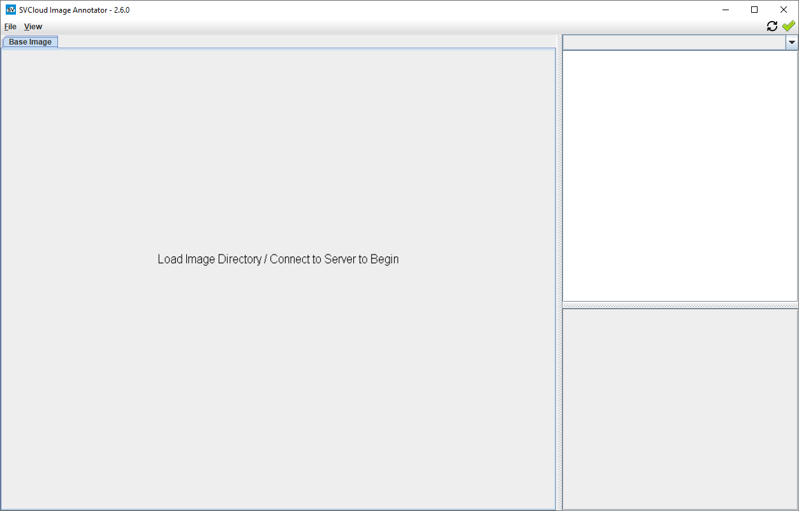
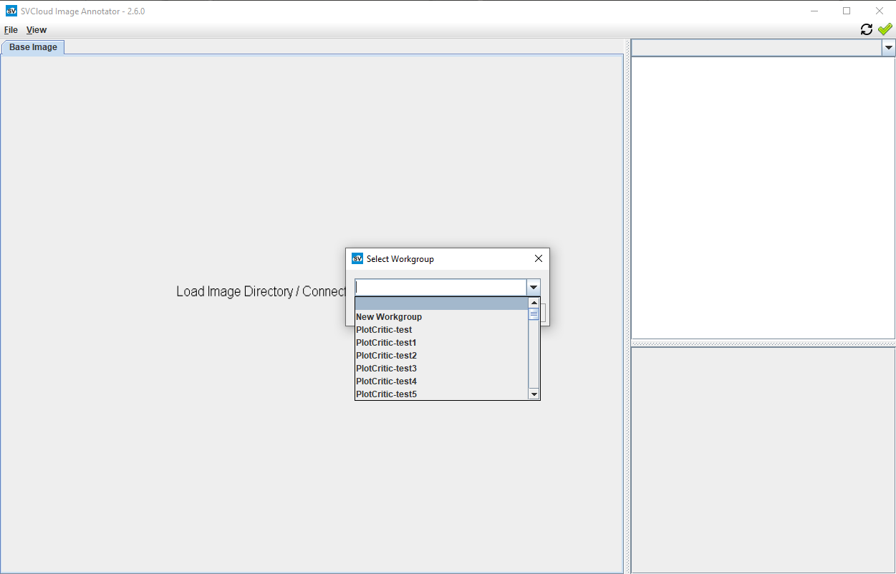
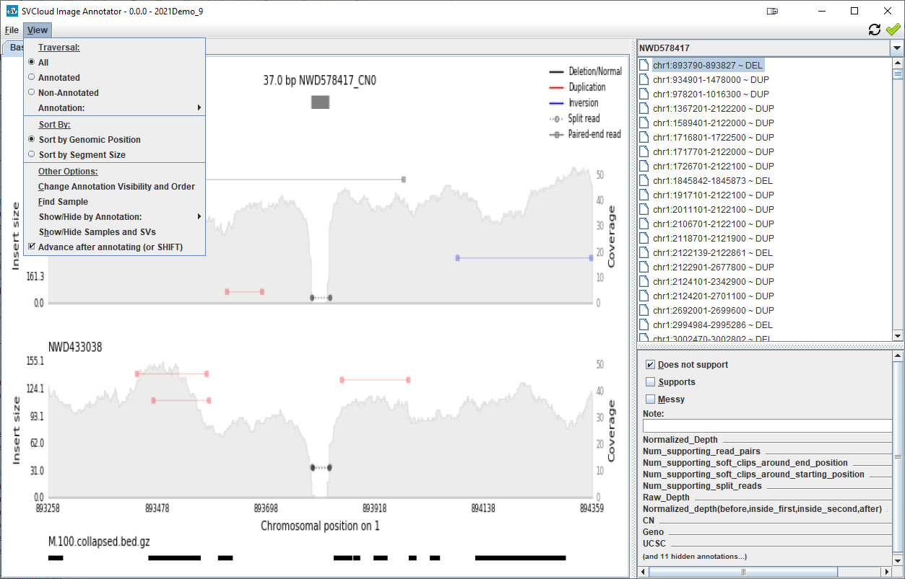
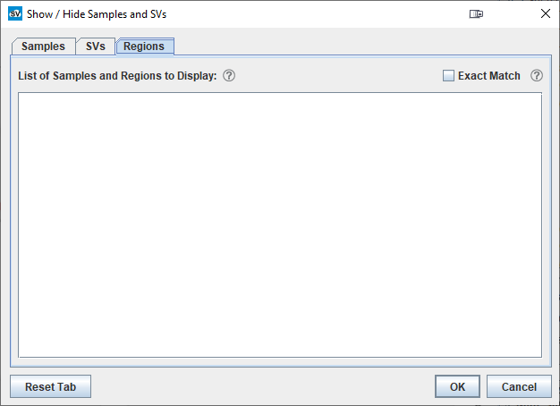

## Getting Started with SVCloud Image Annotator (SVCA)
{:.no_toc}

### Table of Contents
{:.no_toc}

* TOC
{:toc}

### Connecting to the Server 

First, open the menu and select "Connect to Server":

A browser window will open and ask you to login to Google.  After login this window can be closed.  

<a href="#">Back to top</a>

### Creating a Workgroup  

After connecting, the workgroup selection popup will appear.
 

The dropdown menu lists all workgroups to which your username has access.   

To begin, create a new workgroup; or, choose a workgroup and press the 'Select' button.

To create a new workgroup, type a new workgroup name into the selection field and press 'Configure'.

<a href="#">Back to top</a>

### Configuring a Workgroup

The workgroup configuration window will open, allowing you to add users and editable annotations to your new workgroup.  

You are automatically a group admin in your new workgroup (you can change this, but you might not be able to change it back!).  

<a href="#">Back to top</a>

### Creating Annotations

Annotations come in four types: `boolean`, `numeric`, `text`, and `category`.  

The first three are straightforward: boolean annotations are yes/no, numeric annotations accept any number value, and text annotations accept any text input.  

Annotation categories are annotations with a restricted subset of options, similar to a menu or dropdown.  

You can add any number of values to an annotation category.  Users can either select any number of options, or you can choose to restrict the selection to a single value.

<a href="#">Back to top</a>

### Loading Image Files

After selecting or creating your workgroup, SVCA will return to the ready screen.  However, the ready message has changed and new menu options are now available:

From here, open the `File` menu and select `Load Image Files`. You will be shown a directory selection dialog from which you can load images. 

Loading images prior to connecting to a server, or into an empty workgroup, will parse sample names and SVs from the directory structure.

SVCA expects all images for each sample to be contained in a directory with the same name as the sample, e.g.: ...\images\NWD585842\NWD585842_CN0_chr1_893790_893827.png

To load images, select the directory that contains all of the sample subdirectories - e.g. in ...\images\NWD585842\NWD585842_CN0_chr1_893790_893827.png you would select the "images" directory.

Do not select a particular sample sub-directory, as this will not result in properly loaded images.

Nor should there be additional directories parallel to the sample subdirectories, as these will be parsed (incorrectly) as samples, e.g.:

**Note** the options on the right-hand of the directory selection GUI for:  
 - Calling Algorithm
 - Calling Algorithm Version
 - Genome Build
 - Technology
 
These options **cannot** be changed later, and must match existing annotations for SVCA to link images to annotations properly.

<a href="#">Back to top</a>

### Uploading Annotations from a Manifest File

To upload annotation data in bulk, select the `File` menu and then the `Upload Data` option.

First, select a file by clicking the caret ( `>` ) button. A file selector GUI will open and the appropriate file can be selected.

**Note** the options on the right-hand of the directory selection GUI for:  
 - Calling Algorithm
 - Calling Algorithm Version
 - Genome Build
 - Technology
 
These options **cannot** be changed later, and must match existing images for SVCA to link annotations to images properly.

After selecting the file, the file location will be displayed on the Upload Data GUI. From here, the `Open` button can be selected, which will parse the file into samples and SVs to be loaded.  

Annotations can be renamed and (de)selected. Errors will be shown if there are name conflicts or other issues.  When ready, press the `Upload` button to begin the upload process.

<a href="#">Back to top</a>

### View Menu Options

SVCA has a number of options for altering what and how samples and SVs are shown.

##### Traversal

Traversal options control SVCA behavior when using keyboard controls or the auto-advance feature.  SVCA can be set to advance to the next un/annotated SV, or the next SV with a particular annotation.

##### Sort By

SVCA can sort SVs for a selected sample either by genomic order (chr & start position) or by SV length (in base-pairs).

### Change Annotation Visibility & Order

This option opens a menu from which annotations can be drag-and-drop reordered, or hidden from view entirely.

### Show/Hide Samples and SVs

SVCA can filter samples and SVs with the Show/Hide Samples and SVs menu option. There are three scopes of filtering - sample, SV, and sample & SV.

The first, sample filtering, requires a list of sample names.

The second menu shows all SV types, copy numbers, calling algorithms, and calling algorithm versions - these can be selected or deselected as desired. Additionally, genomic regions (e.g. chr1:100-10000) can be entered in the text field.

Lastly, for more specific filtering, the last text field can be used to filter down to specific sample & SV combinations.

<a href="#">Back to top</a>

### Support / Contact

Having trouble with SVCA?  Please contact us at help@genvisis.org for assistance.  
**If possible, please attach the most recent log file to your email.**

Logs are located:
 - on Windows computers at `%LocalAppData%/sv-image-annotator/app/logs/`  
    (this location can be changed in the `File` menu)

<a href="#">Back to top</a>

### Changelog

#### v2.6.3   (02/11/2021)
 - Allow loading images from TAR archives
 - Ignore missing values (e.g.: '.', '-', 'NA', etc) in manifest files
 - Add tooltip to upload GUI reset button
 - Report program version at startup and check against remote version
 - Show data upload error code in pop-up
 - Fix text field width for text annotations
 - Fix upload GUI progress monitoring when (up)loading large manifest files
 - Fix Show/Hide for SVs
 - Reduce excess redraws

#### v2.6.2  (02/07/2021)  
 - Fix bugs in validation using BED files 
 
#### v2.6.1  (02/01/2021)  
 - Fix visual spacing in right-click menu and add manifest file format mouseover info
 - Parse CN# in image file name (instead of DUP/DEL/etc)

#### v2.6.0   (06/05/2020)  
 - Add icon to all windows
 - Add sample/sv delete
 - Add hide by annotation menu
 - Update menu labels and structure
 - Update delete dialog message
 
 
<a href="#">Back to top</a>

